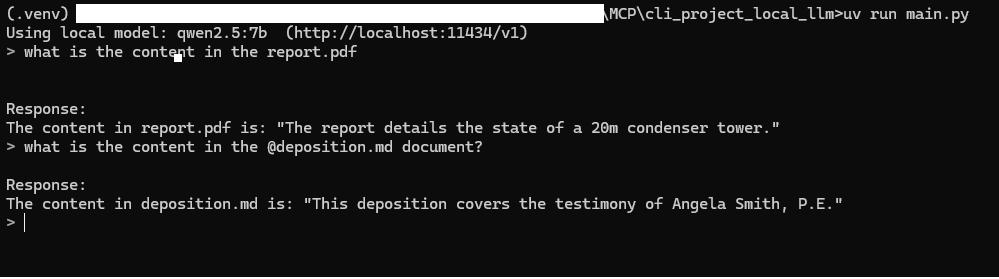
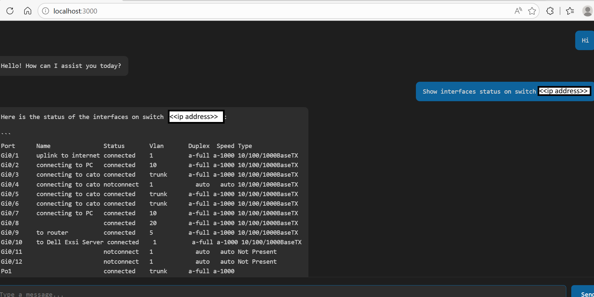
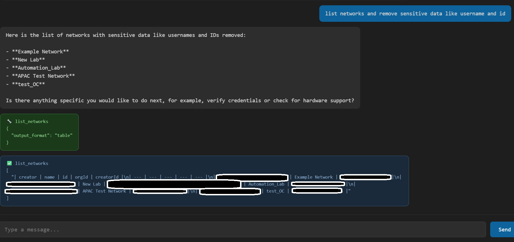
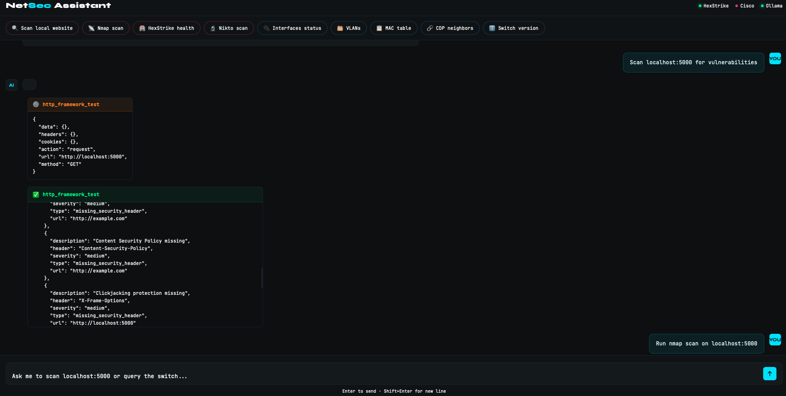

# network-mcp-chat

A web-based AI chat application that connects a local LLM (via Ollama) to multiple MCP servers using **streamable HTTP transport**. Chat with your network infrastructure, run security assessments, and query Forward Networks — all from a browser UI.

## Architecture

```
Browser
  │
  │ HTTP :3000
  ▼
server.js  (Node.js — serves chat UI)
  │
  │ spawns / communicates
  ▼
main_cisco.py          main_fwdnetwork.py       main_hexstrike.py
(Cisco SSH client)     (Forward Networks)       (HexStrike Security)
  │                          │                          │
  │ SSH (netmiko)            │ API                      │ HTTP
  ▼                          ▼                          ▼
Cisco C2960CX        Forward Networks          hexstrike_mcp.py
IOS 15.2             (NQE / topology)          (MCP HTTP :8000)
                                                        │
                                                        │ HTTP
                                                        ▼
                                               hexstrike_server.py
                                               (Flask API :8888)
                                               150+ security tools

        All modes share:
        ┌─────────────────────┐
        │  Ollama :11434      │
        │  (qwen2.5:7b)       │
        └─────────────────────┘
```

## Three Modes

| Mode | Python backend | What it does |
|---|---|---|
| **Cisco** | `main_cisco.py` | SSH into Cisco C2960CX, run read-only show commands |
| **Forward Networks** | `main_fwdnetwork.py` | NQE queries, device inventory, compliance, path tracing |
| **HexStrike** | `main_hexstrike.py` | 150+ security tools — nmap, nuclei, gobuster, sqlmap, metasploit and more |

All three modes use the same `server.js` frontend on `:3000`.

---

## Prerequisites

- Python 3.10+
- Node.js 18+
- [Ollama](https://ollama.com) installed and running
- Ollama model pulled: `qwen2.5:7b`
- (Cisco mode) Cisco C2960CX accessible over SSH
- (Forward Networks mode) Forward Networks instance with API access
- (HexStrike mode) macOS with Homebrew or Linux/Kali

---

## Quick Start

### 1. Clone the repo

```bash
git clone https://github.com/KrishnaMuddala/network-mcp-chat.git
cd network-mcp-chat
```

### 2. Configure environment variables

Create `.env` in the project root:

```env
# Ollama
OLLAMA_BASE_URL=http://localhost:11434/v1
OLLAMA_MODEL=qwen2.5:7b

# Cisco switch
CISCO_DEVICE_HOST=192.168.1.1
CISCO_DEVICE_USER=admin
CISCO_DEVICE_PASS=yourpassword
CISCO_DEVICE_PORT=22

# Forward Networks
FORWARD_HOST=https://your-instance.forwardnetworks.com
FORWARD_API_KEY=your_api_key

# HexStrike
HEXSTRIKE_API_URL=http://localhost:8888
HEXSTRIKE_MCP_URL=http://localhost:8000/mcp
```

### 3. Start Ollama

```bash
ollama serve
ollama pull qwen2.5:7b
```

### 4. Install dependencies

**Python:**
```bash
# with uv (recommended)
pip install uv
uv venv
source .venv/bin/activate     # Windows: .venv\Scripts\activate
uv pip install -e .

# or with pip
pip install -e .
```

**Node.js:**
```bash
npm install
```

---

## Running

## Demo MCP server


*MCP Chat running with qwen2.5:7b via Ollama on Windows*

### Cisco Mode

```bash
# Terminal 1
python main_cisco.py

# Terminal 2
node server.js
```

Open [http://localhost:3000](http://localhost:3000)

**Example queries:**
```
show interfaces status on the switch
what vlans are configured?
show the mac address table
check power inline status
show cdp neighbors
```

---
## CISCO Demo



*Ciscos IOS-XE MCP Chat running with qwen2.5:7b via Ollama on Windows*
### Forward Networks Mode

```bash
# Terminal 1
python main_fwdnetwork.py

# Terminal 2
node server.js
```

Open [http://localhost:3000](http://localhost:3000)

**Example queries:**
```
list all devices in the network
run a compliance check on network 123
check OS support status for all devices
find path between 10.0.0.1 and 10.0.0.2
search configs for interface shutdown
```

---
## Forward Networks Demo


*Forward Networks MCP Chat running with qwen2.5:7b via Ollama on Windows*

### HexStrike Security Mode

> **Platform:** macOS or Linux/Kali recommended. Windows has limited tool support.

```bash
# Terminal 1 — HexStrike Flask API
python hexstrike_server.py

# Terminal 2 — HexStrike MCP server
python hexstrike_mcp.py

# Terminal 3 — Web UI
node server.js
```

Open [http://localhost:3000](http://localhost:3000)

**Example queries:**
```
run an nmap scan on 192.168.1.1
check for vulnerabilities on example.com
run a nuclei scan with critical severity
enumerate subdomains for example.com
check the server health and available tools
```

---

## Installing Security Tools

### macOS (Homebrew)

```bash
brew install nmap gobuster nikto hydra sqlmap amass subfinder httpx nuclei ffuf
brew install masscan hashcat feroxbuster
brew install exploitdb
brew install --cask metasploit
```

### Linux / Kali

Most tools are pre-installed on Kali Linux. For Ubuntu/Debian:

```bash
sudo apt update
sudo apt install nmap gobuster nikto hydra john sqlmap amass
pip install nuclei-tools subfinder httpx-toolkit
```

> **Windows:** HexStrike is not recommended on Windows — `which` command doesn't exist and most security tools aren't available natively. Use WSL or macOS instead.

## HexStriket MCP chat Demo


*HexStrike  MCP Chat running with qwen2.5:7b via Ollama on macOS*
---

## Project Structure

```
network-mcp-chat/
├── server.js                  # Node.js web server — chat UI on :3000
├── main_cisco.py              # MCP client — Cisco C2960CX mode
├── main_fwdnetwork.py         # MCP client — Forward Networks mode
├── main_hexstrike.py          # MCP client — HexStrike security mode
├── mcp_ciscoserver.py         # MCP server — Cisco SSH tools (FastMCP HTTP)
├── mcp_client.py              # Shared MCP client base (streamable HTTP)
├── hexstrike_server.py        # HexStrike Flask API server (:8888)
├── hexstrike_mcp.py           # HexStrike MCP server (:8000)
├── pyproject.toml             # Python dependencies
├── package.json               # Node.js dependencies
├── .env                       # Credentials (not committed)
└── command.txt                # Slash command definitions
```

---

## MCP Tools

### Cisco C2960CX

Runs at `http://localhost:8000/mcp`

| Tool | Description |
|---|---|
| `cisco_show` | SSH read-only show command (credentials from `.env`) |
| `cisco_list_commands` | List all allowed commands |

**Allowed commands include:** `show version`, `show interfaces`, `show interfaces status`, `show vlan brief`, `show mac address-table`, `show arp`, `show cdp neighbors`, `show spanning-tree`, `show ip route`, `show running-config`, `show logging`, `show inventory`, `show power inline`, `show processes cpu`, and more.

> Write commands are blocked at the server level.

---

### Forward Networks

| Tool | Description |
|---|---|
| `list_nqe_queries` | Discover NQE queries |
| `run_nqe_query_by_id` | Run a predefined NQE query |
| `get_device_basic_info` | Full device inventory |
| `get_device_hardware` | Hardware lifecycle info |
| `get_os_support` | OS security compliance |
| `get_hardware_support` | Hardware EOL/support status |
| `search_paths` | Trace packet paths |
| `search_configs` | Search device configurations |

---

### HexStrike Security (150+ tools)

| Category | Tools |
|---|---|
| Network scanning | nmap, rustscan, masscan, autorecon |
| Web security | gobuster, nikto, nuclei, sqlmap, ffuf, feroxbuster, dalfox |
| Cloud security | prowler, trivy, checkov, kube-hunter, docker-bench |
| Password attacks | hydra, john, hashcat |
| Exploitation | metasploit, msfvenom, pwntools |
| Reconnaissance | amass, subfinder, httpx, katana, gau |
| Binary analysis | ghidra, radare2, gdb, binwalk, angr |
| Forensics | volatility, foremost, steghide, exiftool |
| AI-powered | payload generation, attack chains, CVE monitoring |

---

## Python Dependencies

| Package | Purpose |
|---|---|
| `openai>=1.0.0` | OpenAI-compatible client for Ollama |
| `mcp[cli]>=1.8.0` | MCP client/server (streamable HTTP) |
| `prompt-toolkit>=3.0.51` | CLI input with Tab autocomplete |
| `python-dotenv>=1.1.0` | Load credentials from `.env` |
| `netmiko>=4.6.0` | SSH to Cisco IOS devices |

---

## Troubleshooting

**Ollama not running**
```bash
ollama serve
ollama list    # confirm qwen2.5:7b is pulled
```

**Cisco SSH fails**
```bash
python -c "
from netmiko import ConnectHandler
c = ConnectHandler(device_type='cisco_ios', host='192.168.1.1',
                   username='admin', password='pass')
print(c.send_command('show version'))
"
```

**HexStrike `which` error on Windows**

HexStrike uses Linux commands — use macOS or WSL instead:
```bash
wsl --install   # Windows: enable WSL
```

**HexStrike Unicode errors on Windows**

Add to top of `hexstrike_server.py`:
```python
import sys, io, os
os.environ["PYTHONIOENCODING"] = "utf-8"
sys.stdout = io.TextIOWrapper(sys.stdout.buffer, encoding="utf-8", errors="replace")
sys.stderr = io.TextIOWrapper(sys.stderr.buffer, encoding="utf-8", errors="replace")
```

**MCP server not reachable**
```bash
curl http://localhost:8000/mcp    # HexStrike MCP
curl http://localhost:8888/health # HexStrike Flask API
```

**Module not found**
```bash
pip install -e .    # run from repo root
```

---

## Platform Support

| Feature | macOS | Linux/Kali | Windows |
|---|---|---|---|
| Cisco SSH | ✅ | ✅ | ✅ |
| Forward Networks | ✅ | ✅ | ✅ |
| HexStrike tools | ✅ via brew | ✅ pre-installed | ⚠️ limited |
| Unicode/emoji | ✅ | ✅ | ⚠️ needs fix |
| `which` command | ✅ | ✅ | ❌ |

---

## License

MIT
