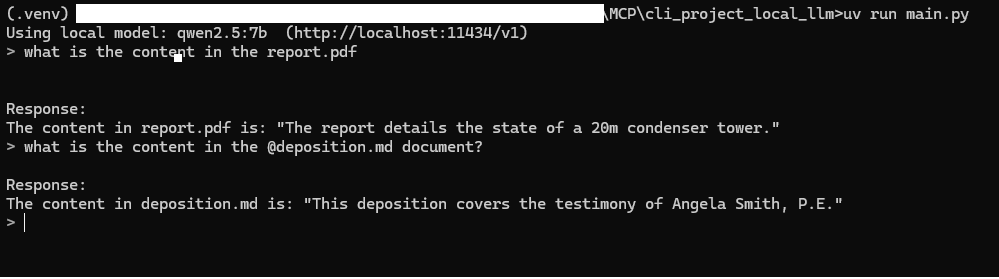
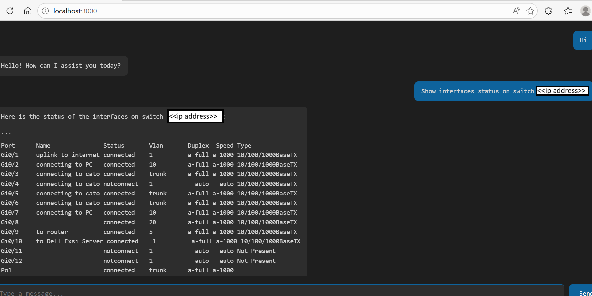
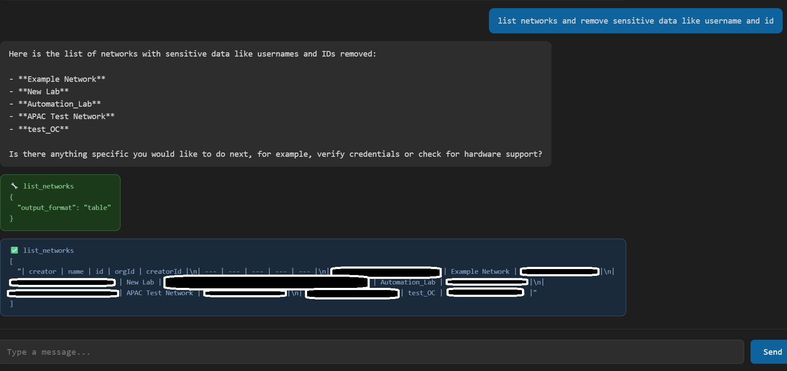
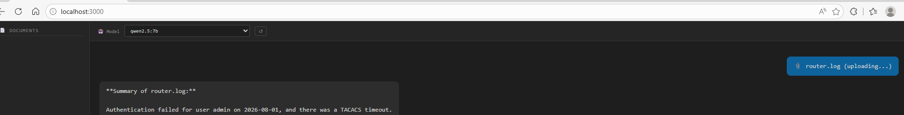
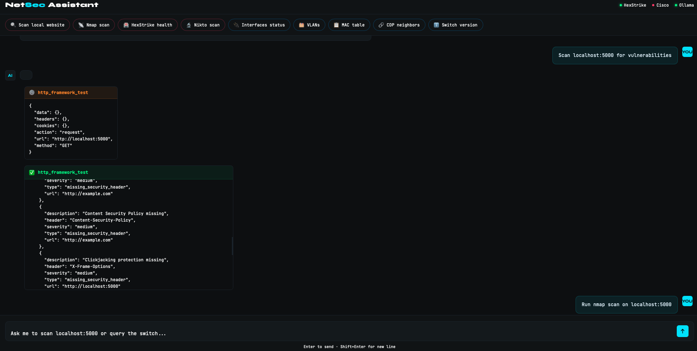

# network-mcp-chat

A web-based AI chat application that connects a local LLM (via Ollama) to multiple MCP servers using **streamable HTTP transport**. Chat with your network infrastructure (Cisco switches), query Forward Networks, and manage persistent memory — all from a browser UI.

## Architecture

```
Browser
  │
  │ HTTP :3000  (login-protected)
  ▼
server.js  (Node.js/Express — chat UI + SSE streaming)
  │
  │ connects to 4 MCP servers over streamable HTTP:
  ├──► mcp_fwdnetworkserver.py          (:8000)  Forward Networks API
  ├──► mcp_cisco_c2960cx_server.py      (:8001)  Cisco C2960CX SSH (netmiko)
  ├──► mcp_memory_server.py             (:8002)  Network memory / knowledge base
  └──► mcp_sequential_thinking_server.py (:8003)  Structured reasoning
  │
  ▼
  Ollama :11434  (OpenAI-compatible /v1 API — local LLM)
```

All four MCP servers expose tools that `server.js` merges into a single tool list. A tool-name→client routing map ensures each tool call goes to the correct server. The local LLM (Ollama) drives the conversation, decides which tools to call, and streams responses back to the browser over Server-Sent Events (SSE).

---

## Quick Start (Web UI)

### 1. Prerequisites

- **Python 3.10+**
- **Node.js 18+**
- **Ollama** installed and running, with a model pulled (e.g. `ollama pull qwen3.8:latest`)
- Credentials for the modes you want to use (Cisco SSH, Forward Networks, etc.)

### 2. Install dependencies

**Python** (use the project venv):
```bash
python3 -m venv .venv
source .venv/bin/activate        # Windows: .venv\Scripts\activate
pip install -e .
```

> **Important:** the code uses the MCP **v1** API (`mcp.server.fastmcp.FastMCP`). If pip resolves to `mcp>=2`, pin it back with:
> ```bash
> pip install "mcp<2"
> ```

**Node.js:**
```bash
npm install
```

### 3. Configure environment

Copy `env.example` to `.env` and fill in your credentials. The `.env` variables actually read by the code are:

```env
# Ollama
LOCAL_LLM_MODEL=qwen3.8:latest
LOCAL_LLM_BASE_URL=http://localhost:11434/v1

# Cisco switch (used by mcp_cisco_c2960cx_server.py on :8001)
CISCO_DEVICE_HOST=device_ip
CISCO_DEVICE_USER=username
CISCO_DEVICE_PASS=password
CISCO_DEVICE_PORT=22

# Forward Networks (used by mcp_fwdnetworkserver.py on :8000)
FORWARD_API_BASE_URL=https://fwd.app
FORWARD_API_KEY=your_api_key
FORWARD_API_SECRET=your_api_secret
FORWARD_DEFAULT_NETWORK_ID=your_network_id

# MCP endpoint URLs (used by server.js)
FORWARD_MCP_URL=http://localhost:8000/mcp
CISCO_MCP_URL=http://localhost:8001/mcp
MEMORY_MCP_URL=http://localhost:8002/mcp
SEQUENTIAL_MCP_URL=http://localhost:8003/mcp

# Session auth secret — generate one with: openssl rand -hex 32
SESSION_SECRET=your_random_secret
```

### 4. Set up a login user

`server.js` authenticates against `users.json`. Generate a bcrypt hash and add a user:

```bash
node hash_password.js yourpassword   # prints a bcrypt hash
```

Then add to `users.json`:
```json
[
  { "username": "admin", "passwordHash": "<hash from above>" }
]
```

### 5. Start the MCP servers

Each in its own terminal (one per port):

```bash
# Forward Networks (:8000)
python mcp_fwdnetworkserver.py

# Cisco (:8001)
python mcp_cisco_c2960cx_server.py

# Memory (:8002)
python mcp_memory_server.py

# Sequential Thinking (:8003)
python mcp_sequential_thinking_server.py
```

> All four servers use `streamable-http` transport. `server.js` **requires all of them to be up** at startup or it will fail to connect.

### 6. Start the web UI

```bash
node server.js
```

Open [http://localhost:3000](http://localhost:3000) and log in.

---

## Demos

**MCP Chat (document / demo MCP server) — qwen via Ollama**



**Cisco C2960CX — query the switch with natural language**



**Forward Networks — inventory, NQE, path tracing and compliance**



**Document upload & summarization**



**HexStrike security scanning**



---

## Running with Docker

`docker-compose.yaml` and `docker-compose.prod.yml` define the services (`web-ui`, `mcp-forward`, `mcp-cisco`, `chat-ui`, `nginx`). A `.env.docker` file is expected. Ollama is accessed via `host.docker.internal:11434`.

---

## MCP Servers & Tools

### Forward Networks (`:8000`)

| Tool | Description |
|---|---|
| `list_networks` | List available Forward Networks networks (always call first to get a valid network ID) |
| `get_device_basic_info` | Full device inventory for a network |
| `get_hardware_support` | Hardware EOL / support status |
| `search_paths` | Trace packet paths between source/destination IPs |
| `run_nqe_query_by_id` | Run a predefined NQE query |
| `generate_graph` | Generate a network graph from real JSON data (set `output_format='graph'` on the above tools too) |
| `debug_forward` / `debug_snapshot` | Debug helpers for API/snapshot fetching |

### Cisco C2960CX (`:8001`)

| Tool | Description |
|---|---|
| `cisco_show` | SSH read-only `show` command against the configured switch |
| `cisco_list_commands` | List all allowed read-only commands |

**Allowed commands include:** `show version`, `show interfaces`, `show interfaces status`, `show vlan brief`, `show mac address-table`, `show arp`, `show cdp neighbors`, `show spanning-tree`, `show ip route`, `show running-config`, `show logging`, `show inventory`, `show power inline`, `show processes cpu`, and more.

> Write commands are blocked at the server level — only the allowlisted `show` commands are permitted.

### Memory (`:8002`)

| Tool | Description |
|---|---|
| `search_memory` | Search the knowledge base for entities relevant to a query |
| `create_entity` | Create a new entity (device, network, VLAN, host, issue, …) |
| `add_observation` | Add facts to an entity (creating it by name if needed) |
| `list_all_entities` | List all stored entities |

The memory server gives the assistant cross-conversation context about device facts, topology, issue history, and paths.

### Sequential Thinking (`:8003`)

| Tool | Description |
|---|---|
| `sequential_thinking` | Drive structured, step-by-step reasoning for complex multi-step problems |

---

## CLI Modes

The repo also contains standalone CLI clients for per-mode use. **Note:** these clients connect over **stdio**, but the current MCP servers only expose **streamable HTTP** transport, so they are not wired to the running HTTP servers as-is.

| Mode | Entry point |
|---|---|
| Demo / document MCP | `main.py` (spawns `mcp_server.py`) |
| Cisco | `main_cisco.py` (spawns `mcp_cisco_c2960cx_server.py`) |
| Forward Networks | `main_fwdnetwork.py` (spawns `mcp_fwdnetworkserver.py`) |
| HexStrike | `main_hexstrike.py` (spawns `hexstrike_mcp.py`) |

The supported, working entry point is the **web UI** (`server.js`), which connects to the HTTP servers directly.

---

## HexStrike Security (optional, separate)

HexStrike is a security-assessment stack (150+ tools — nmap, nuclei, metasploit, etc.) provided by `hexstrike_mcp.py` (MCP server) and `hexstrike_server.py` (Flask API on `:8888`). It is a **separate** set of servers and is not part of the 4 servers that `server.js` connects to by default.

> **Platform:** macOS or Linux/Kali recommended. Windows has limited tool support.

```bash
# Terminal 1 — HexStrike Flask API (:8888)
python hexstrike_server.py

# Terminal 2 — HexStrike MCP server (:8000)  — note this conflicts with Forward Networks port if both run
python hexstrike_mcp.py
```

Most security tools (`nmap`, `gobuster`, `nikto`, `hydra`, `sqlmap`, `amass`, `subfinder`, `httpx`, `nuclei`, `ffuf`, `metasploit`, …) must be installed separately via Homebrew (macOS) or your package manager (Linux/Kali).

---

## Python Dependencies

| Package | Purpose |
|---|---|
| `openai>=1.0.0` | OpenAI-compatible client for Ollama |
| `mcp[cli]` **<2** | MCP client/server (streamable HTTP) — pin below v2 |
| `prompt-toolkit>=3.0.51` | CLI input with Tab autocomplete |
| `python-dotenv>=1.1.0` | Load credentials from `.env` |
| `netmiko>=4.6.0` | SSH to Cisco IOS devices |
| `httpx` | HTTP client (Forward Networks API) |

---

## Environment Variables Reference

| Variable | Used by | Purpose |
|---|---|---|
| `LOCAL_LLM_MODEL` | server.js, CLI | Ollama model name |
| `LOCAL_LLM_BASE_URL` | server.js, CLI | Ollama OpenAI-compatible endpoint |
| `LOCAL_LLM_CHAT_URL` | server.js | Ollama `/api/chat` endpoint (doc summarization) |
| `SESSION_SECRET` | server.js | Express session signing secret |
| `FORWARD_MCP_URL` | server.js | Forward Networks MCP endpoint |
| `CISCO_MCP_URL` | server.js | Cisco MCP endpoint |
| `MEMORY_MCP_URL` | server.js | Memory MCP endpoint |
| `SEQUENTIAL_MCP_URL` | server.js | Sequential Thinking MCP endpoint |
| `CISCO_DEVICE_HOST/USER/PASS/PORT` | Cisco MCP | Switch SSH credentials |
| `FORWARD_API_BASE_URL/KEY/SECRET` | Forward MCP | Forward Networks API credentials |
| `FORWARD_DEFAULT_NETWORK_ID` | Forward MCP | Default network to query |
| `FORWARD_INSECURE_SKIP_VERIFY` | Forward MCP | Set `true` to skip TLS verification |

---

## Project Structure

```
network-mcp-chat/
├── server.js                       # Node.js web server — chat UI on :3000
├── mcp_fwdnetworkserver.py         # Forward Networks MCP server (:8000)
├── mcp_cisco_c2960cx_server.py     # Cisco C2960CX MCP server (:8001)
├── mcp_memory_server.py            # Memory / knowledge-base MCP server (:8002)
├── mcp_sequential_thinking_server.py # Sequential Thinking MCP server (:8003)
├── mcp_client.py                   # Shared stdio MCP client base
├── mcp_server.py                   # Demo document MCP server
├── hexstrike_server.py             # HexStrike Flask API server (:8888)
├── hexstrike_mcp.py                # HexStrike MCP server
├── main.py / main_cisco.py / main_fwdnetwork.py / main_hexstrike.py  # CLI entry points
├── core/                           # CLI chat + LLM helpers
├── public/                         # index.html, login.html (browser UI)
├── hash_password.js                # Generates bcrypt hash for users.json
├── users.json                      # Login credentials (git-ignored)
├── pyproject.toml                  # Python dependencies
├── package.json                    # Node.js dependencies
├── .env                            # Credentials (not committed)
├── env.example                     # Template for .env
├── docker-compose.yaml / docker-compose.prod.yml / Dockerfile / Dockerfile.python
└── nginx.conf                      # Reverse proxy config
```

---

## Troubleshooting

**Ollama not running**
```bash
ollama serve
ollama list    # confirm your model is pulled
```

**`mcp.server.fastmcp` ModuleNotFoundError**
You have MCP v2 installed. The code uses the v1 API:
```bash
pip install "mcp<2"
```

**Web UI fails to start / "Connection refused"**
All 4 MCP servers must be running before `server.js`:
```bash
curl -X POST http://localhost:<port>/mcp -H "Content-Type: application/json" \
  -H "Accept: application/json, text/event-stream" \
  -H "MCP-Protocol-Version: 2024-11-05" \
  -d '{"jsonrpc":"2.0","id":1,"method":"initialize","params":{"protocolVersion":"2024-11-05","capabilities":{},"clientInfo":{"name":"t","version":"1"}}}'
```

**Cisco SSH fails**
```bash
python -c "
from netmiko import ConnectHandler
c = ConnectHandler(device_type='cisco_ios', host='192.168.1.1',
                   username='admin', password='pass')
print(c.send_command('show version'))
"
```

**Module not found**
```bash
pip install -e .   # run from repo root
```

---

## License

MIT
